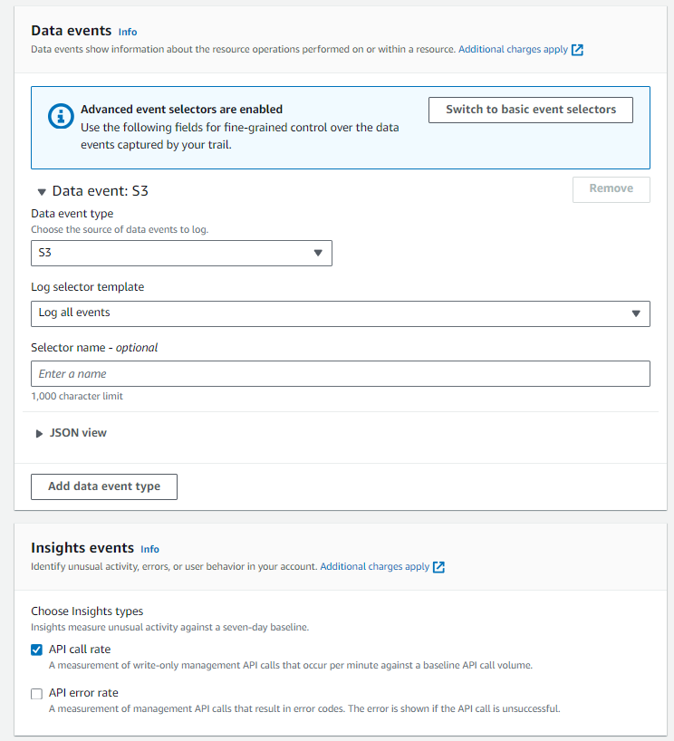
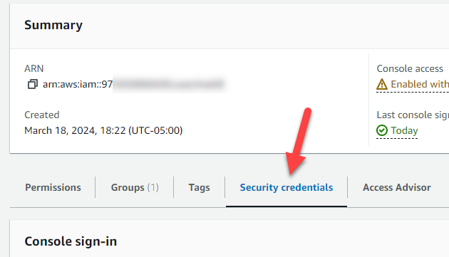
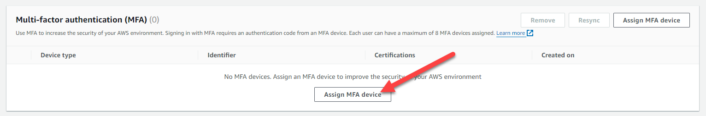

# Securing S3 Buckets in AWS
# Purpose of This Guide
S3 buckets provide cheap, redundant storage in the cloud that can be used by businesses of all sizes. Unfortunately, S3 buckets are not always easy to configure securely. This has lead to plenty of data breaches across companies of all shapes and sizes. This guide provides some concrete guidance on how to adjust settings in your S3 buckets in order to secure them against various threats. 

# A Note About NIST 800-53
The National Institute of Standards and Technology (NIST) maintains a framework of controls that should be implemented in order to secure various systems. That framework ([link here](https://csrc.nist.gov/pubs/sp/800/53/r5/upd1/final)) is called NIST SP 800-53. This guide follows NIST 800-53 and the authors of this guide have picked out the applicable security controls from that framework and used that to guide the instructions below. If your organization utilizes NIST 800-53, or if you are curious about which controls this guide helps you implement, see the [NIST Control Mapping](nist-control-mapping.md) section of this guide for more information. 

# Table of Contents
- [Safely Sharing Files Publicly via S3](#safely-sharing-files-publicly-via-s3)
- [Enabling Logging for Accountability in S3](#enabling-logging-for-accountability-in-s3)
	- [Turn On Server Access Logging](#turn-on-server-access-logging)
	- [Implementing CloudTrail Logging](#implementing-cloudtrail-logging)
- [Protecting S3 Buckets by Limiting Public Access](#protecting-s3-buckets-by-limiting-public-access)
	- [Restricting Public Access to S3 Buckets](#restricting-public-access-to-s3-buckets)
	- [Testing Public Access Restrictions](#testing-public-access-restrictions)
- [Removing Overly Permissive Admin Accounts](#removing-overly-permissive-admin-accounts)
- [Identification and Authentication in S3](#identification-and-authentication-in-s3)

# AC Access Control
The AC Control Family consists of security requirements detailing system logging. The applicable control for S3 buckets is below: 
- AC-2(12)
- AC-22

AC-(12) Reads as:
> Monitor system accounts for [Assignment: organization-defined atypical usage]; and Report atypical usage of system accounts to [Assignment: organization-defined personnel or roles].

This control is covered later by CloudFlare and System Access logging. This information can be found in the next section of Audit and Accountability

AC-22 Reads as:
> Designate individuals authorized to make information publicly accessible; Train authorized individuals to ensure that publicly accessible information does not contain nonpublic information; Review the proposed content of information prior to posting onto the publicly accessible system to ensure that nonpublic information is not included; and Review the content on the publicly accessible system for nonpublic information [Assignment: organization-defined frequency] and remove such information, if discovered.

# Safely Sharing Files Publicly via S3
This can be acheived by simply allowing public access to specifc buckets.

In order to do this we will need to create a specifc bucket designated for public access. Once we have the bucket we can navigate to the permissions tab within the bucket. 


Once here we must find the "Block public access (bucket settings)" sections and select the edit option.


Within the edit page you can deselect all options to allow for public access to the bucket. 


# AU Audit and Accountability
The AU control family comprises security controls related to an organization’s audit capabilities. The applicable control for S3 buckets is below: 
- AU-2
- AU-3
- AU-8
- AU-9
- AU-9(3)
- AU-9(4)
- AU-10
- AU-12
- AU-12(1)
- AU-12(3)
# Enabling Logging for Accountability in S3

## Turn On Server Access Logging
Server Access logging will cover controls: AU-2, AU-3, AU-8, AU-10, AU-12.
These controls read as:

AU-2:
> Determines that the information system is capable of auditing the following events: [Assignment: organization-defined auditable events];

AU-3:
> The information system generates audit records containing information that establishes what type of event occurred, when the event occurred, where the event occurred, the source of the event, the outcome of the event, and the identity of any individuals or subjects associated with the event.

AU-8:
> Use internal system clocks to generate time stamps for audit records; and
Record time stamps for audit records that meet [Assignment: organization-defined granularity of time measurement] and that use Coordinated Universal Time, have a fixed local time offset from Coordinated Universal Time, or that include the local time offset as part of the time stamp.

AU-10:
> The information system protects against an individual (or process acting on behalf of an individual) falsely denying having performed [Assignment: organization-defined actions to be covered by non-repudiation].

AU-12:
> Provides audit record generation capability for the auditable events defined in AU-2 at [Assignment: organization-defined information system components];
Allows [Assignment: organization-defined personnel or roles] to select which auditable events are to be audited by specific components of the information system; and
Generates audit records for the events defined in AU-2 d. with the content defined in AU-3.

To cover these controls we will be enabling and configuring Server Access Logging

In order to hold the logs we will need to create a new logging bucket. This can be done by navigating to S3 within your AWS account and selecting "Create New Bucket".

Then we can navigate to the bucket that needs to be logged and select the properties tab. 


On the Server Access Logging section we can choose edit then enable. 

Once on the configuration page select your new logs bucket from the “Browse S3” option. Then select the “[DestinationPrefix][SourceAccountId]/​[SourceRegion]/​[SourceBucket]/​[YYYY]/​[MM]/​[DD]/​[YYYY]-[MM]-[DD]-[hh]-[mm]-[ss]-[UniqueString]” option and ensure logs are created based on event time. If done correctly it should look like this. 


Logs will now generate and can be tested by making any changes on the chosen bucket, and checking the logs bucket to ensure data was created.

## Implementing CloudTrail Logging
Server Access logging will cover controls: AU-2, AU-10, AU-11, AU-12, AU-12(1), AU-12(3).
These controls read as:

AU-2:
> Determines that the information system is capable of auditing the following events: [Assignment: organization-defined auditable events];

AU-10:
> The information system protects against an individual (or process acting on behalf of an individual) falsely denying having performed [Assignment: organization-defined actions to be covered by non-repudiation].

AU-12:
> Provides audit record generation capability for the auditable events defined in AU-2 at [Assignment: organization-defined information system components];
Allows [Assignment: organization-defined personnel or roles] to select which auditable events are to be audited by specific components of the information system; and
Generates audit records for the events defined in AU-2 d. with the content defined in AU-3.

AU-12(1):
> Compile audit records from [Assignment: organization-defined system components] into a system-wide (logical or physical) audit trail that is time-correlated to within [Assignment: organization-defined level of tolerance for the relationship between time stamps of individual records in the audit trail].

AU-12(3):
> The information system provides the capability for [Assignment: organization-defined individuals or roles] to change the auditing to be performed on [Assignment: organization-defined information system components] based on [Assignment: organization-defined selectable event criteria] within [Assignment: organization-defined time thresholds].

In order to create an audit trail we will be using CloudTrail to do this we will:

Navigate to the properties tab in your desired bucket.


Open the CloudTrail tab and select the trails tab

Create a new trail and choose a name

Either create a new logging bucket or use an existing S3 bucket designated for logging.

Create a new name for your new KMS key or choose an existing KMS key from the drop down


Navigate to the next page
On the next page select Management Events, Data Events, and Insight Events


Under Data Events choose S3 from the drop down and log all events from the next drop down

Under Insight Events select API Call Rate



# Protecting S3 Buckets by Limiting Public Access
One potential threat against S3 buckets is the leaking of sensitive data publicly. Often times S3 buckets are used to store sensitive data and we need to make sure that data is not accessible publicly. Below are instructions for limiting public access to your S3 buckets. 

## Restricting Public Access to S3 Buckets
In order to restrict connections to the S3 bucket from only internal sources, we can turn on the "Block Public Access" setting from within the S3 settings page. 


Doing this means that any external connections to the bucket would be blocked. This sort of configuration is appropriate for high and potentially medium-security baseline configurations. It would not be appropriate for low-security configurations that require public access for hosting files publicly.

## Testing Public Access Restrictions
In order to test CA-9, we first need to confirm that the bucket is not accessible publicly. We can verify this by logging into the AWS S3 console and going to the properties of the bucket in question. In the "Bucket overview" section we see that there is no public URL listed. This indicates that the bucket is not accessible publicly. 


# Removing Overly Permissive Admin Accounts
Administrator accounts are used to manage and configure infrastructure within AWS. However, overly permissive admin accounts have the ability to wreak havoc on your S3 bucket settings, and can change settings that might cause a degradation of security. One way to prevent this from happening is to lock down which admin accounts have access to sensitive S3 settings such as bucket ACLs. 

## Setting up a Bucket Policy to Limit Administrator Permissions
Bucket policies are a feature of S3 buckets in AWS that allow you to grant or restrict access to S3 buckets, and they can even apply down to the object level within buckets.

In order to restrict access to administrative-level actions on an S3 bucket, you would want to restrict the ability to modify or remove bucket policies and ACLs. There are AWS "Actions" that correspond to those three administrative actions. We can write a bucket policy which has an "Allow" effect for specified principals (AWS users).

In order to more easily write up a bucket policy to block access to the bucket policy for certain administrators, we can use the AWS policy generator tool. The tool can be found here: https://awspolicygen.s3.amazonaws.com/policygen.html

Once on the policy generator page, we select "S3" as the policy type. 


Next, select "Deny" as the intended effect of this policy statement. You will need to fill in the Principal (the administrator account ARN(s) that you would like to deny access to), and select the below three options from the "Actions" dropdown:

- DeleteBucketPolicy
- GetBucketPolicy
- PutBucketPolicy

Click "Add Statement" at the bottom in order to add that policy statement.


In this case, we only need to add one statement. So, we are able to click "Generate Policy" at the bottom. This will generate the policy for us, and you can copy that policy right out of the generator and keep it handy for the next steps.

Below is an example of a policy that applies to a single AWS IAM user and allows that user to modify the bucket policies (and therefore the settings of the bucket itself).

```
{
	"Version": "2012-10-17",
	"Statement": [
		{
			"Sid": "Statement1",
			"Principal": {
			    "AWS":"arn:aws:iam::975050068436:user/mattE"
			},
			"Effect": "Deny",
			"Action": [
				"s3:DeleteBucketPolicy",
				"s3:PutBucketPolicy",
				"s3:GetBucketPolicy"
			],
			"Resource": [
				"arn:aws:s3:::uno-8950-high-sec-baseline"
			]
		}
	]
}
```

Now, open up the bucket you intend to apply this policy to. Click on the "Permissions" tab to bring up the permissions page, where the bucket policy is located. 


Find the Bucket policy section, and click the "Edit" button. 


Copy and paste the policy into the Policy section of the page, and click "Save changes" at the bottom.


You have successfully denied access to the selected administrators to edit or remove the bucket policy.

## Testing Administrator Permissions Restrictions
In order to test this control, we need to attempt to make changes to the bucket policy as one of the users (principals) listed in the principal list in the above policy, and as a user not listed in the principal list. We would expect that the user in the principal list could edit the policy, while the user not in the principal list could not edit the policy.

If, as a principal of an administrator who was denied access to edit the bucket policy (as seen above) we try and access the bucket policy page, we should see the below error message if the access is correctly blocked.


If we are able to see the bucket policy (and no error message is shown like the one above), the control is not in place.

# Identification and Authentication in S3
Identifying individual users and authenticating those users so that you can restrict access and assign permissions appropriately is crucial. 

## Implementing Authentication for S3 Users
When looking at an S3 bucket, the primary means of enforcing authentication is to utilize the built-in AWS authentication mechanisms. User management is done through the IAM (Identity and Access Management) console from within the AWS Console. After logging in to the AWS console, you can select "IAM" from the list of AWS services. 


## Implementing Multi-factor Authentication on AWS Accounts
Implementing multi-factor authentication stops an attacker who compromises your credentials from being able to access the AWS console, by requiring the user to provide a second factor upon logging in. To enable multi-factor authentication on an account in AWS, you first need to navigate to the IAM menu. Once you're there, click on "Users" on the left side in the menu. 


Next, click on the name of the user you wish to implement MFA for. Click on the "Security credentials" tab. 



Click on "Assign MFA device" and follow the prompts to set up either a virtual authenticator app (such as Google Authenticate) or a physical FIDO device (such as a Yubikey). 



Once that has been completed, MFA is enabled for that user. 

## Testing Multi-factor Authentication


# SC System and Communications Protection
The System and Communications Protection control focuses on safeguarding the integrity, confidentiality, and availability of information systems and communications. For S3 Buckets here are the controls that apply:
- SC-5
- SC-8(1)
- SC-12
- SC-12(1)
- SC-13
- SC-28
- SC-28(1)

## AWS S3 bucket Denial of Service Protection (Implementing AWS Shield)
NIST 800-53 control SC-5 reads:
> Restrict the ability of individuals to launch the following denial-of-service attacks against other systems

**Sign in to the AWS Management Console**: Go to the [AWS Management Console](https://console.aws.amazon.com/). 

**Navigate to AWS Shield**: In the AWS Management Console, use the search bar or navigate to the "Security, Identity, & Compliance" section and click on "Shield" under "Security."


**Choose AWS Shield Advanced (optional)**: AWS shield offers two shield services standard and advanced. If an organization require additional protection and features beyond the basic protection offered by AWS Shield Standard, they can subscribe to AWS Shield Advanced. This includes advanced DDoS protection and 24/7 access to the AWS DDoS Response Team (DRT). Something to note is that AWS Shield Standard is automatically enabled for all AWS customers at no extra cost. 


**Enable AWS Shield on Amazon S3**: If using AWS Shield Advanced, follow the instructions provided in the AWS Shield console to enable the service for your Amazon S3 buckets.


To specifically enable the shield for a specific S3 bucket press on add resources to protect and select your bucket and configure the desired protection settings. You can then see what services AWS shield advanced are serving.

  

**Review Protection Settings**: Once AWS Shield is enabled for the S3 buckets, review and configure the protection settings as needed like setting up mitigation preferences, configuring advanced protection features, and defining notification preferences for DDoS events. [AWS Shield advanced update](https://aws.amazon.com/blogs/aws/aws-shield-advanced-update-automatic-application-layer-ddos-mitigation/).


**Monitor DDoS Events**: AWS Shield provides visibility into DDoS events and alerts through the AWS Management Console, CloudWatch alarms, and Amazon S3 access logs. It is good practice to monitor these channels regularly to stay informed about any DDoS activity targeting the S3 buckets and take appropriate action as necessary.[AWS Shield advanced update](https://aws.amazon.com/blogs/aws/aws-shield-advanced-update-automatic-application-layer-ddos-mitigation/).

## Enabling Server-Side Encryption (SSE) and Key Management Service (KMS) for AWS S3 buckets
NIST 800-53 control SC-8,12,12(1),13,28 and 28(1) read respectfully:
> - Protecting the confidentiality and integrity of transmitted information
> - Establish and manage cryptographic keys when cryptography is employed within the system in accordance with key management requirements
> - Maintain availability of information in the event of the loss of cryptographic keys by users.
> - Cryptographic Protection
> - Protect the information at rest
> - Implement cryptographic mechanisms to prevent unauthorized disclosure and modification of information at rest

These controls focus on establishing and managing cryptographic keys used for encryption and decryption to protect sensitive information during transmission, storage or archived. Overall, implementing these controls help establish robust cryptographic systems, secure data transmission and storage, and mitigate the risks associated with unauthorized access or disclosure of sensitive information.

 **Sign in to the AWS Management Console**: Go to the [AWS Management Console](https://console.aws.amazon.com/).

 **Navigate to Amazon S3**: From the list of AWS services, select "S3" to access the Amazon S3 dashboard.

 


 **Select the S3 Bucket**: Click on the name of the S3 bucket for which you want to enable server-side encryption.

 **Configure Bucket Properties**: Once the bucket is selected , click on the "Properties" tab.


 **Enable Server-Side Encryption**: Scroll down to the "Default encryption" section and click on it to expand the options.

 


 **Choose Encryption Type**: Select the encryption type you want to use for server-side encryption. There are three options available:

    - Server-side encryption with Amazon S3 managed keys (SSE-S3): This is Amazon S3-managed encryption, where AWS automatically handles the encryption and decryption of your objects using Advanced Encryption Standard (AES) with 256-bit keys.

    - Server-side encryption with AWS Key Management Service keys (SSE-KMS): This option allows you to use AWS Key Management Service (KMS) to manage encryption keys. SSE-KMS provides additional control and auditing capabilities, allowing you to create and manage keys and define access policies.

    - Dual-layer server-side encryption with AWS Key Management Service keys (DSSE-KMS): Amazon S3 applies two individual layers of object-level encryption to satisfy compliance requirements for highly regulated customers.


 **Save Changes**: After selecting the desired encryption type, click "Save" to apply the encryption settings to the bucket.

 **Access Control List (ACL)**: Ensure that the bucket's ACL settings are configured to allow only authorized users and applications to access the bucket. This helps prevent unauthorized access to the encrypted data.

 **Upload Encrypted Data**: Upload objects to the S3 bucket as usual. Amazon S3 automatically encrypts these objects using the specified server-side encryption method.

## Configuring AWS Key Management Service (KMS) for S3 Bucket

**Sign in to the AWS Management Console:**
   Go to the [AWS Management Console](https://aws.amazon.com/console/) and sign in to your AWS account.

**Navigate to AWS KMS:**
   Navigate to the AWS Key Management Service (KMS) console. You can find it by typing "KMS" in the search bar at the top of the console.
  


**Create a Customer Master Key (CMK):**
   - Click on "Customer managed keys" in the left navigation panel.
   - Click on the "Create key" button.
     

   - Choose the key creation method (e.g., "Symmetric").
     

     


   - Define key details, usage permissions, and rotation settings.
     
     

     

     


   - Review and create the CMK.
     


**Note the Key ARN:**
   After creating the CMK, note down the Amazon Resource Name (ARN) of the CMK.
   

  


**Navigate to AWS S3:**
   Go to the AWS S3 console by typing "S3" in the search bar or under the "Storage" section.

**Select the S3 Bucket:**
   Choose the bucket for which you want to enable encryption using AWS KMS.

**Enable Default Encryption:**
   - Click on the "Properties" tab of the selected bucket.
   - Click on "Edit" under the "Default encryption" section.

**Choose KMS Encryption:**
   Select "AWS-KMS" as the default encryption method.
   


**Select the KMS Key:**
   Choose the KMS master key (CMK) created earlier from the dropdown list.

**Save Changes:**
    Click on the "Save changes" button to enable encryption for the S3 bucket using AWS KMS.


# SI System and Information Integrity
The System and Information Integrity (SI) control provides guidelines for ensuring the integrity of system information. Essentially, it aims to protect against unauthorized changes to information within a system and ensures that systems operate correctly and securely. For S3 Buckets here are the controls that apply:
- SI-4(2),(5),(12),(20)
- SI-7
- SI-7(1),(2),(5),(7)
- SI-11
- SI-12
 NIST 800-53 SI-4(2),(5),(12),(20), read respectfully:
> - Employ automated tools and mechanisms to support near real-time analysis of events.
> - Alert when the system-generated indications of compromise or potential compromise occur
> - Alert using automated mechanisms when the indications of inappropriate or unusual activities with security or privacy implications occur
> - Implement the following additional monitoring of privileged users.

These controls focus on continuous monitoring of security controls and operational status in information systems including both real-time and periodic monitoring activities to detect and respond to security incidents. Activities like security status monitoring, monitoring security controls, system events, and security-related information to maintain situational awareness and promptly address emerging threats or vulnerabilities.

*See Access Control: Server access login and Cloud trail implementation*

NIST 800-53 SI-7,(1),(2),(5),(7) read respectfully:
> - Employ integrity verification tools to detect unauthorized changes to the following software, firmware, and information
> - Perform an integrity check
> - Employ automated tools that provide notification to defined personnel upon discovering discrepancies during integrity verification.
> - Automatically shut the system down; restart the system
> - Incorporate the detection of unauthorized changes into the organizational incident response capability

These controls focus on ensuring the effectiveness of security controls within an information system making sure that security controls are implemented correctly, operate as intended, and provide the necessary protection against security threats

*See Access Control: Server access login and Cloud trail implementation*

## AWS Simple Notification Services (SNS) for an AWS S3 Bucket

**Sign in to the AWS Management Console:**
   Go to the [AWS Management Console](https://aws.amazon.com/console/) and sign in to your AWS account.

**Navigate to AWS S3:**
   Go to the AWS S3 console by typing "S3" in the search bar at the top of the console or by finding it under the "Storage" section.

**Select the S3 Bucket:**
   Choose the S3 bucket for which you want to implement notifications using AWS SNS.

**Enable Event Notifications:**
   - Click on the "Properties" tab of the selected bucket.
   - Scroll down to the "Events" section and click on "Create event notification."


**Configure Event Notification:**
   - Enter a name for the notification configuration.
   - Choose the event type(s) that will trigger notifications (ex: "All object create events").
   - Optionally, specify object name prefixes or suffixes to filter the objects that trigger notifications.


   - Select "Send to" as "SNS topic."
   - Choose an existing SNS topic or create a new one.
   


- **Amazon S3 Lifecycle Policies**. With S3 Lifecycle Policies, you can define rules to automatically transition objects between different storage classes or expire objects based on certain criteria. This allows to optimize storage costs and performance by moving less frequently accessed data to lower-cost storage tiers or deleting outdated data after a specified retention period.


  


<p xmlns:cc="http://creativecommons.org/ns#" xmlns:dct="http://purl.org/dc/terms/"><a property="dct:title" rel="cc:attributionURL" href="https://securing-s3-buckets.github.io/s3-security/">Securing S3 Buckets</a> by <span property="cc:attributionName">Matt Estabrook, Mark Magno, and Grace Evah</span> is licensed under <a href="https://creativecommons.org/licenses/by-sa/4.0/?ref=chooser-v1" target="_blank" rel="license noopener noreferrer" style="display:inline-block;">Creative Commons Attribution-ShareAlike 4.0 International</a></p>
